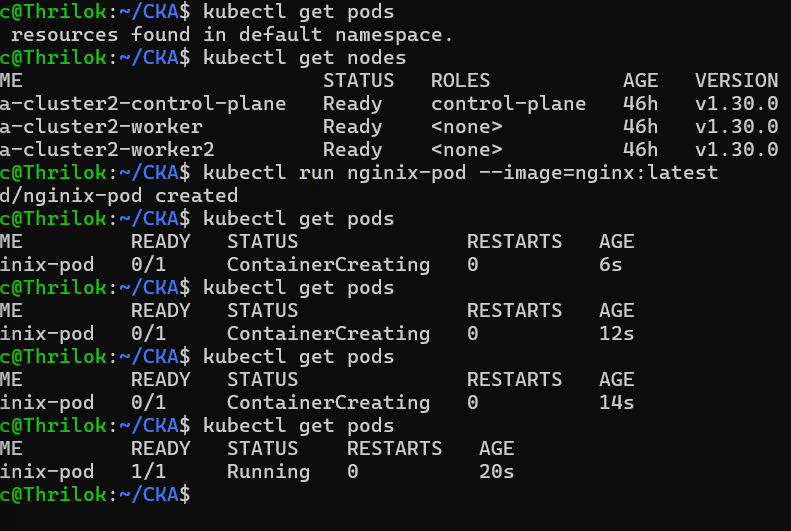

In day7 we are going to learn Pod and fundmentals of YAML

# Pod
We will be starting complete handson of pod from day7

- Two different ways we can create a pod in kubernetes cluster
    1. imperative
    2. Declarative

- In imperative which you run simple commands such as kubectl run pod, basically we are instructing to API Server or with kubectl utility like do this creation or run or delete pods by using imperative way 

- To use Declarative, we use configuartion file like Json or YAML
- Yaml is heavily used in kubernetes
- Json is hardly used in kubernetes, but both can support

- As part of Declarative approach, we create a configuration file and you set deesired state of the object in the files
- examples:
    1. I need to use particualr API version
    2. need to create pod with custom name
    3. need to use particular image
    4. Expose this port 

- so these are the main ways to interacting with cluster via kubectl utilities

- In these handson of Day 7 we will be looking into both 
- You have to understnad both concepts(imperative and Declarative) because both are equally important
- example: kubectl run, get pods these commands are used to troubleshoot and local deployment but not for production - imperative 
- Decalarative will used in production environment and CICD, GitOps and so On

# Lets start with imperative way

1. Create an nginix pod through kubectl imperative way
- command: kubectl run nginx-pod --image=nginix:latest

- Note: so if you see properly first I have created pod using above command as imperative way and nginx pod is created and also it doesn't runing pod directly and it first creating container and its start runing in pod 1/1 
- Ready 1/1 means it has one conatiner and those one container in pod one is runing state. - This 1/1 is important when you having multiple conatiners in pod and these could be helper conatiner, init conatiner or conatiner that will do specific task

# Lets start with Declarative way

1. lets start with creating yaml file in folder to do this demo
2. And here the extension should be yml or YAML anything is fine.
3. why we are using yaml? because of its cleaning and serialize language and its widely used in many other utilitise, promoteus, docker composese ..etc ..,

