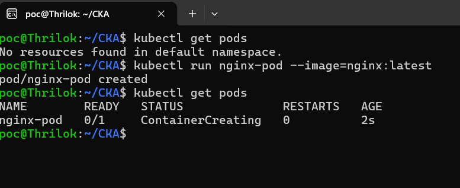
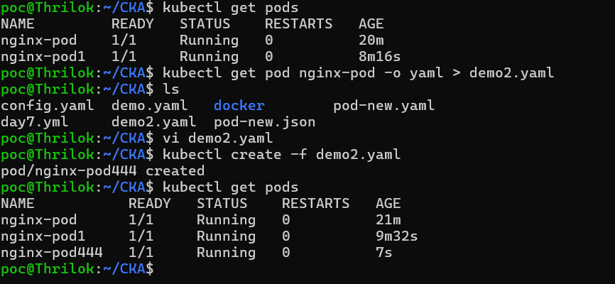
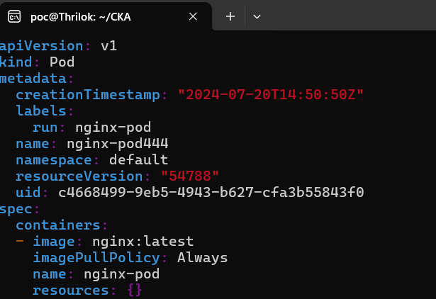
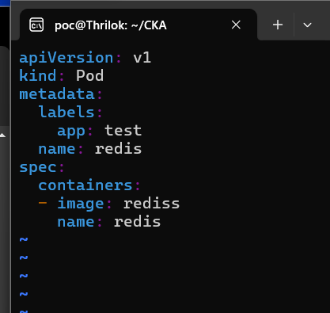
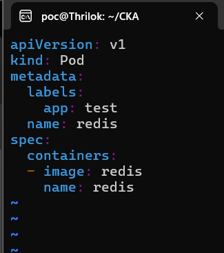
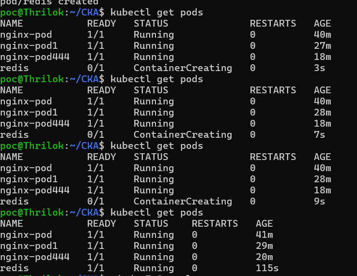

**Task 1**
- Create a pod using the imperative command and use nginx as the image

1. To create pod using imperative way is commands with help of kubectl utility
- command: "kubectl run nginx-pod --image=nginx:latest"
- note: here nginx-pod is we are assigning name to pod when creating using imperative way (nginx-pod)


**Task2**
- Create the YAML from the nginx pod created in task 1
- Update the pod name in the YAML
- Use that YAML to create a new pod with the name nginx-new.

- Answer for Task2 first point 
1. created yaml file from already created pod
- command : is "kubectl get pod nginx-pod -o yaml > demo2.yaml"
- And changed the name in demo2.yaml file and created new pod using kubectl create -f demo2.yaml

 

- Task3
Apply the below YAML and fix the errors, including all the commands that you run during the troubleshooting and the error message


```YAML
apiVersion: v1
kind: Pod
metadata:
  labels:
    app: test
  name: redis
spec:
  containers:
  - image: rediss
    name: redis
```
based on above code my pod is unable to create and its telling ErrImagePull
- 

- In Yaml code the image naming is mistake "rediss" need to change it to "redis"


and now pod started and runing 
