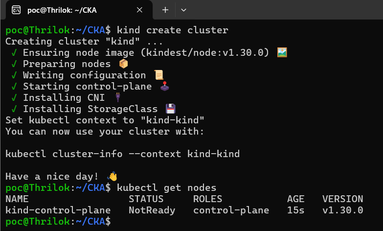
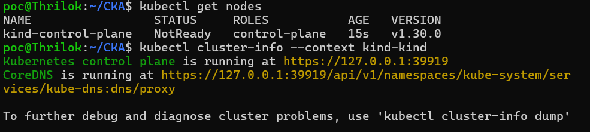
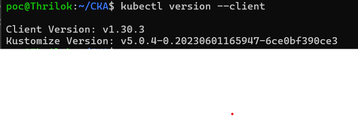
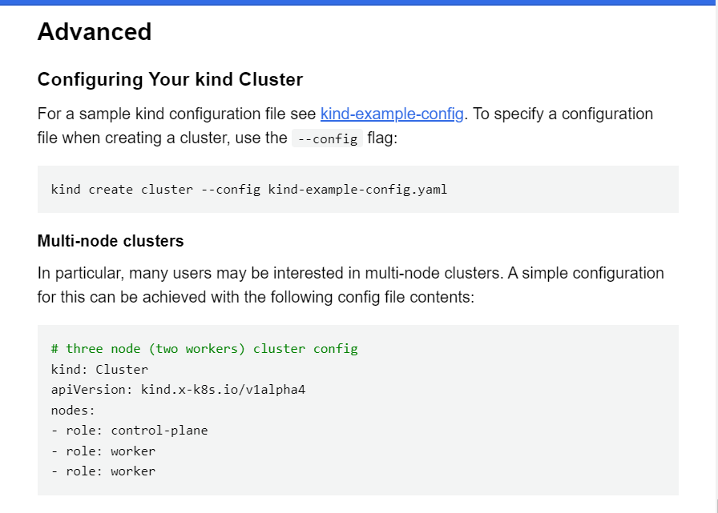
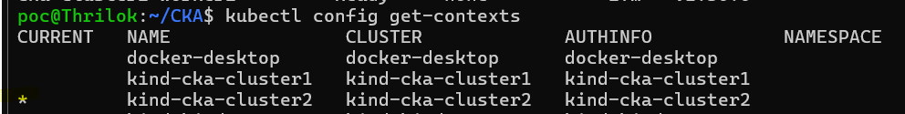
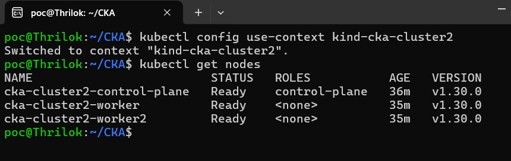

1. we will be using Kind cluster to practice kubernetes in local and not the cloud provider managed services like AWS EKS, AZURE AKS, Google GKE 
2. Because Cloud providers won't provide More options like control plane node

we will be using "Kind" cluster
Installations steps for linux

kind is a tool for running local kubernetes clusters using Docker containers "nodes"

Reference documentation: https://kind.sigs.k8s.io/

**prerequesties**

docker need to be installed

Kind installation steps:

https://kind.sigs.k8s.io/docs/user/quick-start/#installation

**Linux:**

using below release binaries the kind will installed in linux system.

# For AMD64 / x86_64
[ $(uname -m) = x86_64 ] && curl -Lo ./kind https://kind.sigs.k8s.io/dl/v0.23.0/kind-linux-amd64
# For ARM64
[ $(uname -m) = aarch64 ] && curl -Lo ./kind https://kind.sigs.k8s.io/dl/v0.23.0/kind-linux-arm64
chmod +x ./kind
sudo mv ./kind /usr/local/bin/kind

**check version kind version**

"kind --version"

After installing Kind and we need to setup Kind cluster

1. Creating a Kubernetes cluster is as simple as "kind create cluster"

2. To retrive the cluster info " kubectl cluster-info --context kind-kind "

Note: its says the control pane running at some IP in above image and About Core DNS you can reffer here -> 
3. To intreact with cluster you need to install kubectl Utility
4. To install kubectl in local like Linux Environemnt you can refer this link https://kubernetes.io/docs/tasks/tools/install-kubectl-linux/

5. To run kubectl version 
- kubectl version --client 
Note:  And here both Kind and kubectl version should be same and if you are using v1.30.3 in kubectl and kind cluster version should be same

6. so here, it was runing one node for cluster and it have one control pane and worker node runing in same Node

- but it should not run in single node both (control plane and worker node)

7. So, for that we will be creating another cluster with multi Node support 

8. go to kind cluster documentation 

so by using below command we can able to create multi node in single cluster
Command - "kind create cluster --config kind-example-config.yaml"

so in this yaml file having 

# three node (two workers) cluster config
kind: Cluster   # cluster object for kind
apiVersion: kind.x-k8s.io/v1alpha4  # API version is used to call the internal API
nodes: # This field which say nodes so we have 3 roles created so this will create multi node in cluster
- role: control-plane 
- role: worker
- role: worker

9. To copy above yaml code and create a new file in your local system with .yaml extension and paste this yaml content into that file 

command vi demo.yaml
and save

10. So, here we go start to create a cluster with below command 
and version for kind cluster refer release notes here https://github.com/kubernetes-sigs/kind/releases and I will be using here v1.30.0

- command : "kind create cluster --image kindest/node:v1.30.0@sha256:047357ac0cfea04663786a612ba1eaba9702bef25227a794b52890dd8bcd692e --name cka-cluster2 --config demo.yaml" 
and hit enter it will create cluster with 3 nodes

- "important point" : In Realtime production environment the contraol plane node should have multiple nodes to provide high avaialabilty

so here we have installed two clusters 

refer point No: 1 for first cluster creation 
refer point No: 10 for second cluster creation

So To switch between cluster
please refer keubernetes cheat sheet 

Note: How do we remember all commands in the exam 
solution: for above Note: CKA Exam will be completly handson Exam and Exam will test on knowledge on your skills not how you remember the commands 

For that kuberenetes commands there are websites from kubernetes 
one is https://kubernetes.io/docs/reference/kubectl/quick-reference/ 

So To switch between cluster use below commands

- To list how many clusters are there use this commands "kubectl config get-contexts"
- * the star represents in below image is the current cluster we are using 

To switch to another cluster 

kubectl config use-context kind-cka-cluster2
kubectl get nodes 

