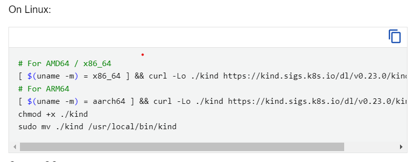

1. we will be using Kind cluster to practice kubernetes in local and not the cloud provider managed services like AWS EKS, AZURE AKS, Google GKE 
2. Because Cloud providers won't provide More options like control plane node

we will be using "Kind" cluster
Installations steps for linux

kind is a tool for running local kubernetes clusters using Docker containers "nodes"

Reference documentation: https://kind.sigs.k8s.io/

**prerequesties**

docker need to be installed

Kind installation steps:

https://kind.sigs.k8s.io/docs/user/quick-start/#installation

**Linux:**

using below release binaries the kind will installed in linux system.

# For AMD64 / x86_64
[ $(uname -m) = x86_64 ] && curl -Lo ./kind https://kind.sigs.k8s.io/dl/v0.23.0/kind-linux-amd64
# For ARM64
[ $(uname -m) = aarch64 ] && curl -Lo ./kind https://kind.sigs.k8s.io/dl/v0.23.0/kind-linux-arm64
chmod +x ./kind
sudo mv ./kind /usr/local/bin/kind

**check version kind version**

"kind --version"

After installing Kind and we need to setup Kind cluster

1. Creating a Kubernetes cluster is as simple as "kind create cluster"
please refer this video 

<video controls src="20240718-0545-15.4881414.mp4" title="Title"></video>
