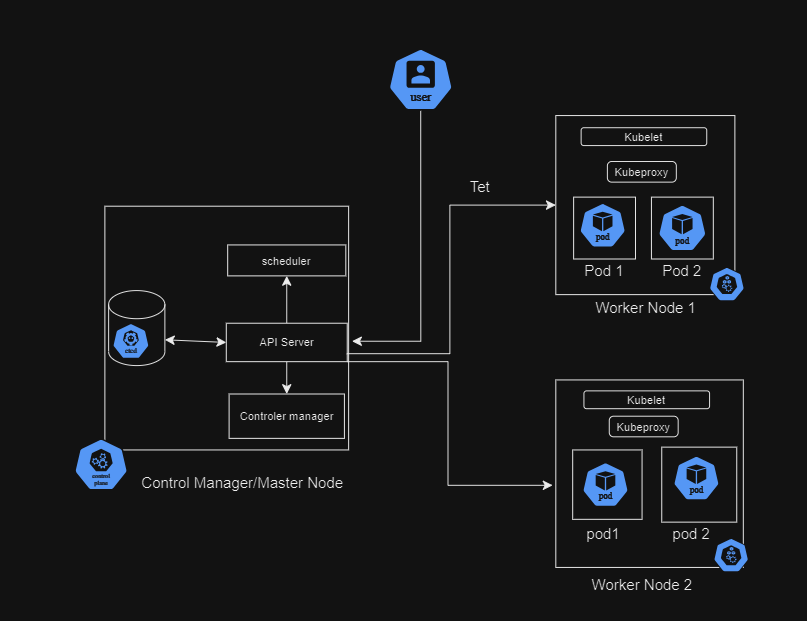

Kubernetes architecture follows a client-server model with two main components:
- Control Plane
- Worker Nodes

**Control Plane**

The Control plane is the brain of the operation, responsible for managing the worker nodes and pods(groups of containers) runing on them. it consistes of several key components 

- API Server: Acts as the central point of communication for the cluster. It receives requests from clients (applications or tools) and commun

**End-to-End flow will work**

1. Lets we have user - like kuberenetes Administartor or DevOps Engineer
2. That user uses CLI utility called kubectl
3.  kubectl helps user to communicate with Cluster and thier components like control plane
4. user basically uses the kubectl client made request to API Server 
5. The API server recives the request and do some checks like Authenticate the request , validate the request
6. Then Request was to create the Pod
    -   "kubectl create pod"

7. once the API Server receives the Request and it does the authentication and validation 
8. And Then its sends the request to Etcd database to add entry in Etcd database
9. once entry is completed in Etcd database and sends back to API Server
10. And here Scheduler is monitoring control plane all the time and scheduler finds that there is pod and thats need to be schedule on a Node
11. Scheduler will inform to API server, I found a node avaialable
12. Then API Server found that node and reach out to worker Node component "Kubelet" and it informs that kubelet to schedule this pod on your node
13. Kubelet will start schedule pod on that node
14. And after creating that pod the kubelet will give response to API Server like the pod creation is completed
15. API Server add entry in the Etcd database " Yes the pod creation is completed"
16. And Finally API Server sends back to reposnse to end user(Admin or DevOps Engineer) like the pod has been created
17. The user will finally recive that request